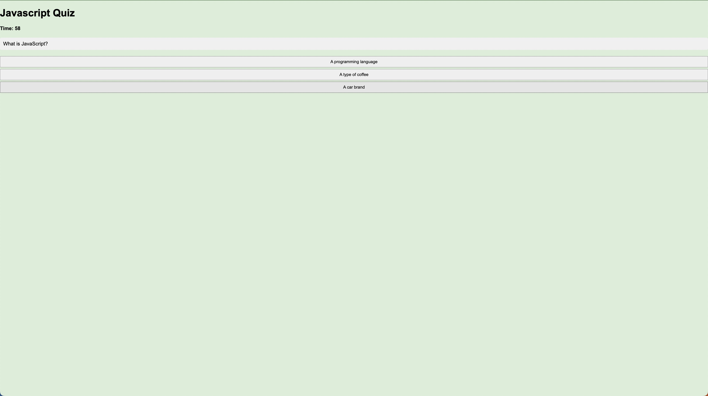

# JavaScript Quiz App

A simple quiz application built with HTML, CSS, and JavaScript. The app allows users to take a timed quiz on JavaScript fundamentals and stores high scores to gauge their progress compared to peers.

## Features

- Start the quiz and answer multiple-choice questions on JavaScript.
- Timer counts down as you progress through the quiz.
- Time is deducted for incorrect answers.
- Display the final score as a percentage.
- Save initials and score for high score tracking.

## Usage

1. Clone the repository:

   ```bash
   git clone https://github.com/cpulsipher24/javascript-quiz.git

   ## Screenshot


##  Technologies used

HTML, CSS, Javascript

## Deployed Link
https://cpulsipher24.github.io/javascript-quiz/

## License
Please refer to the LICENSE file in the repository. 
